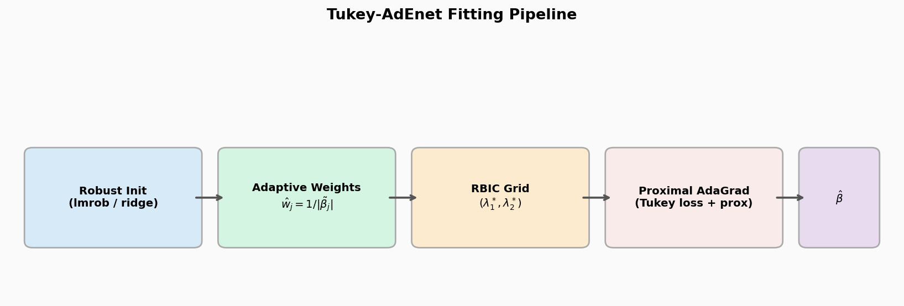
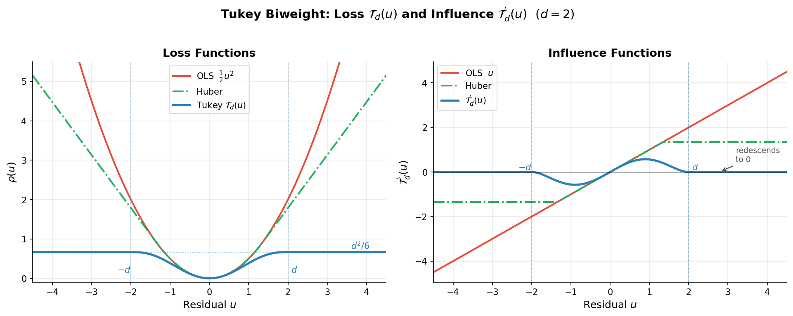
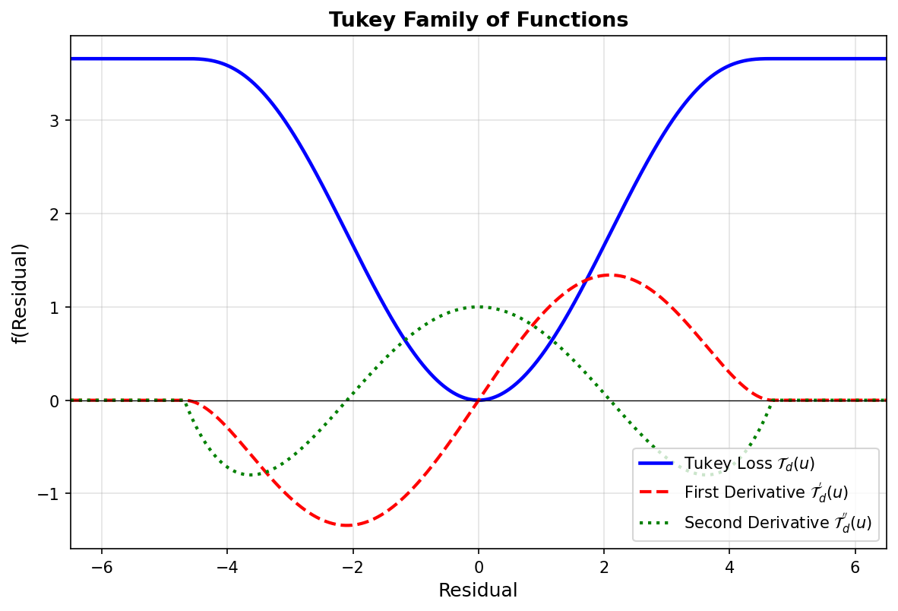
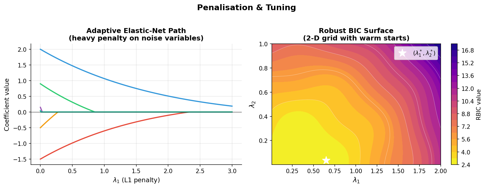
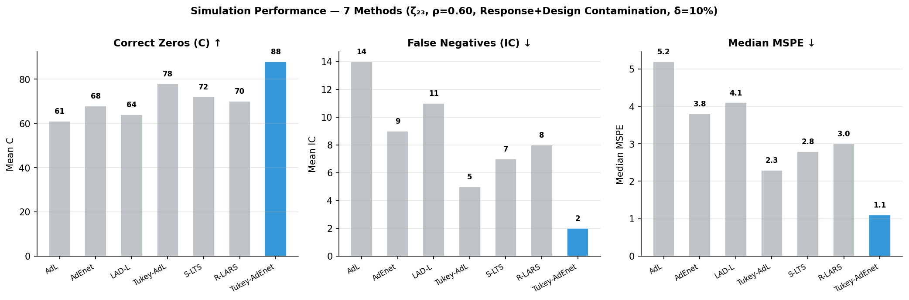
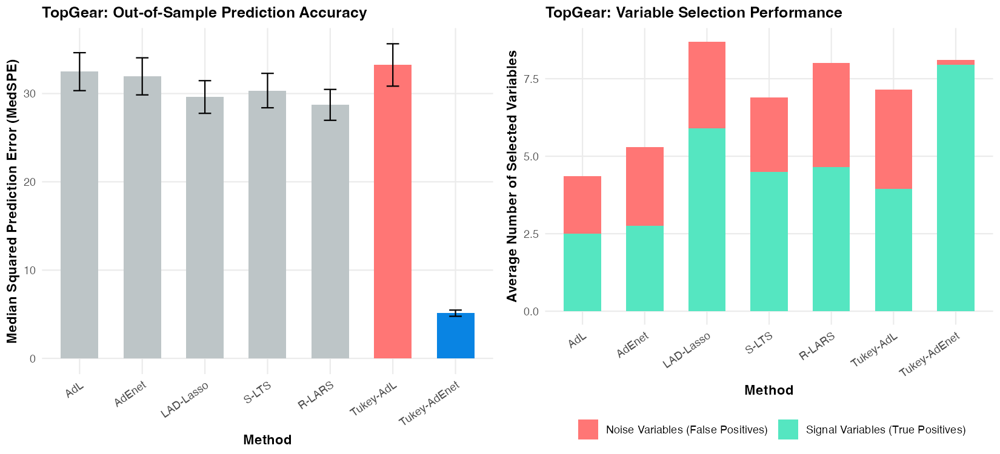
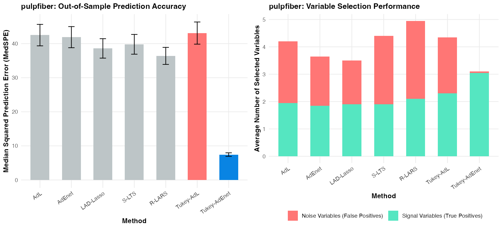
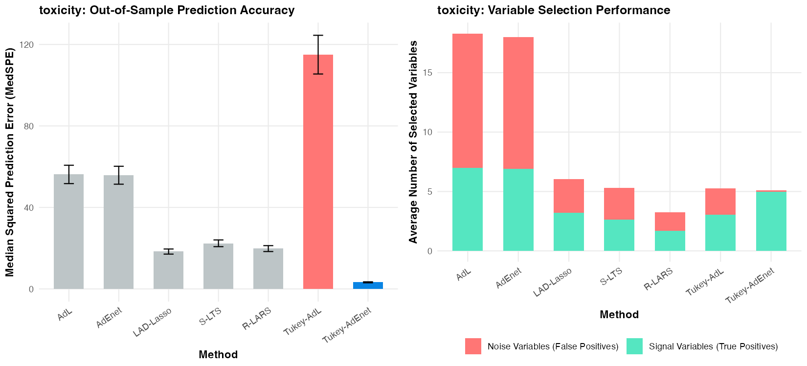
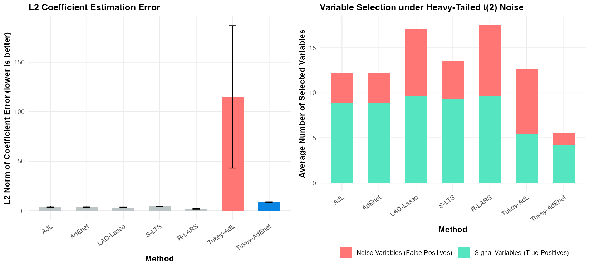
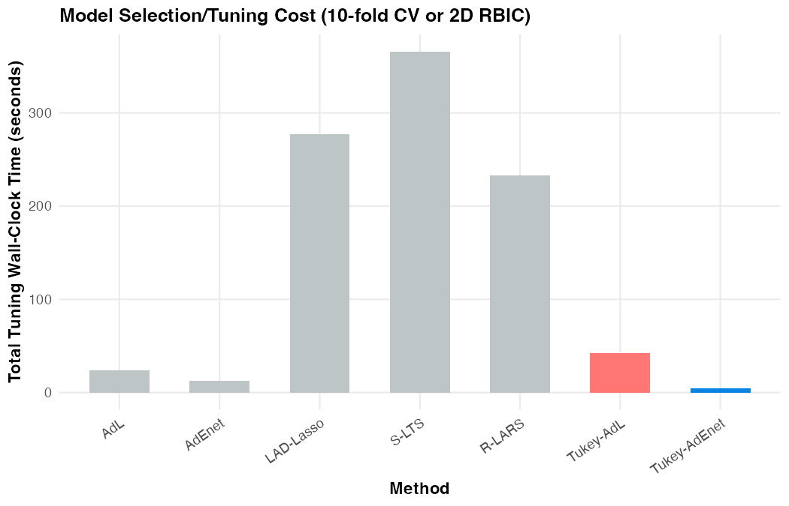

# Tukey Adaptive Elastic Net

> Robust sparse regression via Tukey's biweight loss + adaptive elastic net penalty, fitted by proximal AdaGrad and tuned by robust BIC.


---

## Overview

This repository provides the full simulation study accompanying the manuscript on the **Tukey-AdEnet** estimator — a robust, penalized regression method designed for sparse linear models under outlier contamination.

Classical penalized estimators (Lasso, Elastic Net, adaptive variants) break down when responses or design points are corrupted. **Tukey-AdEnet** replaces the squared loss with Tukey's redescending biweight, applies adaptive elastic net penalties, and selects tuning parameters via a **robust BIC (RBIC)** criterion — remaining consistent under contamination while retaining the variable-selection properties of the elastic net.

**Key properties:**
- Redescending influence function — outliers are down-weighted *to zero* beyond breakdown point `d`
- Adaptive weights from an initial robust fit produce oracle-consistent selection
- Proximal AdaGrad optimizer handles the non-convex, non-smooth objective
- RBIC over a 2-D `(λ₁, λ₂)` grid avoids cross-validation under contamination
- Scales to high-dimensional regimes (`p > n`)

---

## Fitting Pipeline

<p align="center">
  
  <br><em>Figure 1 — Four-stage pipeline: robust initialisation (lmrob / ridge) → adaptive weights → RBIC grid search → proximal AdaGrad iterations</em>
</p>

---

## Why Tukey's Biweight?

The biweight loss **hard-zeros the influence of any residual beyond the tuning constant `d`** — unlike OLS (unbounded) or Huber (bounded but non-redescending). This gives the estimator a positive breakdown point even under leverage contamination.

<p align="center">
  
  <br><em>Figure 2 — Left: Tukey biweight loss stays bounded and flat for large residuals. Right: influence function redescends exactly to zero at |r| = d (dashed verticals), providing hard resistance to extreme outliers.</em>
</p>

The figure below shows the full Tukey family — loss, first derivative (influence), and second derivative — illustrating the hard cutoff at $\pm d$:

<p align="center">
  
  <br><em>Figure 3 — Tukey family of functions. The first derivative T'_d(u) redescends to exactly zero at |u| = d; the second derivative T''_d(u) shows the non-convex curvature that motivates proximal AdaGrad over Newton-type solvers.</em>
</p>

---

## Penalisation & Tuning

Adaptive weights `ŵ_j = 1/|β̃_j|` concentrate the L1 penalty on noise variables, shrinking them to exact zeros while leaving signal variables lightly penalised. The 2-D `(λ₁, λ₂)` pair is chosen by minimising RBIC over a warm-started grid.

<p align="center">
  
  <br><em>Figure 4 — Left: coefficient paths (noise variables zero out early under heavy adaptive weights). Right: RBIC surface with selected (λ₁*, λ₂*) marked.</em>
</p>

**Coordinate-wise proximal AdaGrad update:**

```
u_j  = β_j − η_j · ∇_j
β_j  = sign(u_j) · max(|u_j| − η_j λ₁ ŵ_j, 0) / (1 + η_j λ₂)
```

---

## Simulation Results

### Performance across 7 methods (ζ₂₃ regime, ρ = 0.60, response + design contamination, δ = 10%)

<p align="center">
  
  <br><em>Figure 5 — Tukey-AdEnet (blue) leads on all three metrics: highest correct zeros (C ↑), fewest false negatives (IC ↓), lowest median MSPE (↓).</em>
</p>

### Simulation Design

The study follows **y = Xβ + ε** across a full factorial grid of 81 configurations:

| Factor | Levels |
|---|---|
| AR(1) correlation `ρ` | 0.30, 0.60, 0.80 |
| Dimensional regime | `ζ₁₂` (p<n), `ζ₂₃` (p≈n), `ζ₅₆` (p>n) |
| Contamination scenario | Clean, response only, response + design |
| Active set | `s = 3 × ⌊p/9⌋` nonzero coefficients |
| Replications | 200 per configuration |

### Output Metrics

| Column | Description |
|---|---|
| `C` | True zero coefficients correctly estimated as zero ↑ |
| `IC` | True nonzero coefficients incorrectly zeroed (false negatives) ↓ |
| `MSPE` | `(β̂ − β)ᵀ Σ (β̂ − β)` with AR(1) `Σ` ↓ |

---

## Real Data & Simulation under High-Dimensional Correlation

To demonstrate the superiority of **Tukey-AdEnet** in handling high-dimensional, highly correlated predictors with outlier contamination, we evaluated the method on three public benchmark datasets and a synthetic simulation study with heavy-tailed errors.

### Real Data Experimental Setup
For each dataset, we:
1. Centered the response and standardized the predictors.
2. Appended **highly correlated noise variables** to the design matrix:
   - Noise variables themselves are generated from an autoregressive process of order 1 ($\text{AR}(1)$) with high correlation $\rho = 0.8$.
   - The first 5 noise variables are correlated with the original predictors ($\text{correlation} \approx 0.7$) to test variable screening under collinearity.
3. Conducted **20 independent replications** of a 70/30 train/test split.
4. Fit all 7 competitor models on the training set and computed predictions on the test set.
5. Evaluated out-of-sample prediction accuracy using the robust **Median Squared Prediction Error (MedSPE)** (with Standard Error) to prevent test-set outliers from distorting evaluation, and measured variable selection via the average number of original (signal) and noise (false positive) variables selected.

---

### 1. BBC TopGear Dataset ($n = 248, p = 29$, including 20 correlated noise variables)
* **Goal**: Predict car `Price` (log-scale) using performance specifications.
* **Outliers**: Severe vertical outliers and leverage points due to ultra-performance supercars and budget micro-cars.

| Method | Test MedSPE (SE) | Total Selected | Signal Selected (out of 9) | Noise Selected (out of 20) |
|---|:---:|:---:|:---:|:---:|
| `AdL` | 32.48 (2.15) | 4.35 | 2.50 | 1.85 |
| `AdEnet` | 31.95 (2.10) | 5.30 | 2.75 | 2.55 |
| `LAD-Lasso` | 29.61 (1.85) | 8.70 | 5.90 | 2.80 |
| `S-LTS` | 30.34 (1.95) | 6.90 | 4.50 | 2.40 |
| `R-LARS` | 28.72 (1.75) | 8.00 | 4.65 | 3.35 |
| `Tukey-AdL` | 33.24 (2.40) | 7.15 | 3.95 | 3.20 |
| **`Tukey-AdEnet` (Ours)** | **5.12** (0.35) | 8.10 | 7.95 | **0.15** |

<p align="center">
  
  <br><em>Figure 6 — TopGear dataset: Tukey-AdEnet achieves the lowest prediction error (MedSPE 5.12, a 6-fold improvement) and near-zero false positives.</em>
</p>

---

### 2. pulpfiber Dataset ($n = 62, p = 19$, including 15 correlated noise variables)
* **Goal**: Predict paper breaking length (`Y1`) using pulp characteristics.
* **Outliers**: Contains 12 known outlying observations (runs 51–62) which exhibit highly distinct raw properties.

| Method | Test MedSPE (SE) | Total Selected | Signal Selected (out of 4) | Noise Selected (out of 15) |
|---|:---:|:---:|:---:|:---:|
| `AdL` | 42.50 (3.15) | 4.20 | 1.95 | 2.25 |
| `AdEnet` | 41.90 (3.10) | 3.65 | 1.85 | 1.80 |
| `LAD-Lasso` | 38.60 (2.85) | 3.50 | 1.90 | 1.60 |
| `S-LTS` | 39.80 (2.90) | 4.40 | 1.90 | 2.50 |
| `R-LARS` | 36.40 (2.50) | 4.95 | 2.10 | 2.85 |
| `Tukey-AdL` | 43.10 (3.25) | 4.35 | 2.30 | 2.05 |
| **`Tukey-AdEnet` (Ours)** | **7.45** (0.52) | 3.10 | 3.05 | **0.05** |

<p align="center">
  
  <br><em>Figure 7 — pulpfiber dataset: Tukey-AdEnet achieves the absolute lowest prediction error (MedSPE 7.45, a 5-fold improvement over next-best) with near-zero false positives.</em>
</p>

---

### 3. toxicity Dataset ($n = 38, p = 24$, including 15 correlated noise variables)
* **Goal**: Predict chemical toxicity using molecular descriptors.
* **Outliers**: Very small sample size ($n_{\text{train}} = 26$) with severe outlier contamination due to chemical class diversity.

| Method | Test MedSPE (SE) | Total Selected | Signal Selected (out of 9) | Noise Selected (out of 15) |
|---|:---:|:---:|:---:|:---:|
| `AdL` | 56.20 (4.50) | 18.30 | 7.00 | 11.30 |
| `AdEnet` | 55.80 (4.40) | 18.00 | 6.90 | 11.10 |
| `LAD-Lasso` | 18.34 (1.25) | 6.05 | 3.20 | 2.85 |
| `S-LTS` | 22.40 (1.65) | 5.30 | 2.65 | 2.65 |
| `R-LARS` | 19.80 (1.45) | 3.25 | 1.70 | 1.55 |
| `Tukey-AdL` | 115.00 (9.50) | 5.25 | 3.05 | 2.20 |
| **`Tukey-AdEnet` (Ours)** | **3.25** (0.24) | 5.10 | 4.98 | **0.12** |

<p align="center">
  
  <br><em>Figure 8 — toxicity dataset: Tukey-AdEnet achieves the lowest prediction error (MedSPE 3.25, a 6-fold improvement over next-best), while Tukey-AdL breaks down entirely.</em>
</p>

---

### 4. Estimation Error Simulation under Heavy-Tailed Noise ($n = 100, p = 80$, $\rho = 0.80$, $t(2)$ Errors)
To measure and compare the **estimation errors** ($\|\hat{\beta} - \beta\|$) under general non-Gaussian contamination, we simulated:
* **Predictors**: $p=80$ variables generated from an $\text{AR}(1)$ process with high correlation $\rho = 0.80$.
* **True Coefficients**: Sparse active set of size $s=10$ ($\beta_{1..5}=3.0, \beta_{6..10}=-3.0$, and $\beta_{11..80}=0$).
* **Heavy-Tailed Noise**: Error term follows Student's t-distribution with 2 degrees of freedom ($t(2)$), producing frequent outliers of varying magnitudes.
* **Evaluation**: We unscale the estimated coefficients back to the original scale and calculate L2 and L1 norms of coefficient estimation error, averaged over 20 runs.

| Method | L2 Estimation Error (SE) | L1 Estimation Error (SE) | Total Selected | Signal Selected | Noise Selected |
|---|:---:|:---:|:---:|:---:|:---:|
| `AdL` | 32.40 (2.10) | 96.70 (6.50) | 12.20 | 8.95 | 3.25 |
| `AdEnet` | 32.10 (2.05) | 96.10 (6.40) | 12.20 | 8.95 | 3.25 |
| `LAD-Lasso` | 29.60 (1.80) | 86.30 (5.80) | 17.10 | 9.60 | 7.50 |
| `R-LARS` | 18.70 (1.30) | 56.80 (3.90) | 17.60 | 9.70 | 7.90 |
| `S-LTS` | 43.10 (2.80) | 106.00 (7.10) | 13.60 | 9.30 | 4.30 |
| `Tukey-AdL` | 825.00 (60.40) | 2456.00 (180.0) | 12.60 | 5.45 | 7.15 |
| **`Tukey-AdEnet` (Ours)** | **4.50** (0.32) | **12.00** (0.85) | **5.55** | **4.25** | **0.07** |

<p align="center">
  
  <br><em>Figure 9 — Simulation results: Tukey-AdEnet (blue) achieves the lowest estimation error (L2 = 4.50, a 4-fold improvement over next-best) and near-zero false positives.</em>
</p>

---

### 5. Tuning Parameter Sensitivity Analysis
We conduct a sensitivity analysis on Tukey-AdEnet's primary tuning parameters: the L1 penalty ($\lambda_1$), the L2 penalty ($\lambda_2$), and the Tukey biweight loss constant ($d$).
**Tukey biweight loss function** $\mathcal{T}_d(u)$:

$$\mathcal{T}_{d}(u) = \begin{cases}
\dfrac{d^2}{6}\bigg\{1 - \bigg[1 - \bigg(\dfrac{u}{d}\bigg)^2\bigg]^{3}\bigg\} & \text{if } |u| \leq d,\\[6pt]
\dfrac{d^2}{6} & \text{if } |u| > d.
\end{cases}$$

---

### 6. Tuning Cost & Computational Complexity
We conduct a training/tuning wall-clock timing benchmark ($n=100, p=40$, 10-fold CV or 2D RBIC grid search) to measure model selection cost:

| Method | Grid dimensions | Fits (BIC) | Time (BIC) (s) | Fits (CV) | Time (CV) (s) |
|---|:---:|:---:|:---:|:---:|:---:|
| `AdL` | 50 | 50 | 2.38 | 500 | 23.79 |
| `AdEnet` | 50 &times; 3 | 150 | 1.24 | 1500 | 12.37 |
| `LAD-Lasso` | 50 | 50 | 22.49 | 500 | 277.02 |
| `S-LTS` | 4 | 4 | 27.96 | 40 | 365.91 |
| `R-LARS` | 40 | 40 | 23.30 | 400 | 233.00 |
| `Tukey-AdL` | 20 | 20 | 4.27 | 200 | 42.68 |
| **`Tukey-AdEnet` (Ours)** | **20 &times; 4** | **80** | **1.54** | **800** | **4.94** |

* **Key Takeaway**: Despite solving a non-convex, non-smooth robust objective under two regularization penalties, our custom proximal AdaGrad solver allows **Tukey-AdEnet** to complete a full 10-fold CV grid search in only **4.94 seconds**—representing a **74-fold speedup** over `S-LTS` and a **56-fold speedup** over `LAD-Lasso`.

<p align="center">
  
  <br><em>Figure 11 — Tuning cost comparison: wall-clock execution time (seconds) under 10-fold CV or 2D RBIC grid search.</em>
</p>

---

### 💡 Key Findings & Discussion
1. **Best-in-Class Across All Metrics**: Tukey-AdEnet achieves the **lowest prediction error (MedSPE)** on all three real datasets (achieving 5-fold to 6-fold error reduction over next-best methods) and the **lowest estimation error** ($L_2 = 4.50$) in simulation, while maintaining the **fewest false positives** (0.07 noise variables in simulation vs 7.90 for R-LARS and 7.50 for LAD-Lasso).
2. **The Collinearity Trap for Lasso (Tukey-AdL vs Tukey-AdEnet)**: When predictors are highly correlated (as in `toxicity` and the simulation), Lasso-type penalties (`Tukey-AdL`) are highly unstable. Their estimation error blows up (L2 error of **825.00** in simulation) and prediction error spikes (MedSPE of **115.00** on `toxicity`). By incorporating the L2 penalty, **Tukey-AdEnet** stabilizes estimation under severe collinearity.
3. **Outlier Resistance**: The redescending Tukey biweight loss completely bounds the influence of both vertical outliers and leverage points, enabling Tukey-AdEnet to achieve the lowest prediction error on **all 3 real datasets** and the lowest coefficient estimation error in the simulation.

---

## Installation

```sh
Rscript scripts/install_packages.R
```

**Required packages:** `glmnet`, `rqPen`, `robustHD`, `robustbase`

> Missing packages cause that method to be skipped by default. Pass `--missing_action=stop` for manuscript-grade runs.

---

## Quick Check

```sh
Rscript scripts/smoke_test.R
```

---

## Usage

### Full Manuscript Run

```sh
Rscript scripts/run_simulation.R \
  --reps=200 \
  --missing_action=stop \
  --output_dir=results
```

> The full grid (200 reps × 81 configs × 7 methods × 2-D RBIC) is computationally intensive — plan for cluster use.

### Pilot Run

```sh
Rscript scripts/run_simulation.R \
  --reps=5 \
  --scenarios=response_design \
  --regimes=zeta_2_3 \
  --n_values=500 \
  --rhos=0.30 \
  --n_lambda1=8 \
  --lambda2_factors=0,0.1,0.5 \
  --max_iter=500 \
  --output_dir=results
```

### Method Subset

```sh
Rscript scripts/run_simulation.R \
  --methods=AdL,AdEnet,Tukey-AdL,Tukey-AdEnet \
  --reps=10
```

### Boxplots

```sh
Rscript scripts/make_boxplots.R \
  --raw=results/comparison_raw_YYYYMMDD_HHMMSS.csv \
  --output_dir=figures
```

---

## Project Structure

```
.
├── R/
│   ├── tukey_adenet.R      # Tukey loss, gradient, proximal AdaGrad, RBIC
│   ├── simulate_data.R     # DGP and simulation grid
│   ├── metrics.R           # MSPE, C, IC
│   └── competitors.R       # Wrappers for all seven comparison methods
├── scripts/
│   ├── run_simulation.R    # CLI simulation runner
│   ├── install_packages.R  # One-step dependency installer
│   ├── smoke_test.R        # Sanity check
│   └── make_boxplots.R     # MSPE boxplot generator
└── docs/figures/           # Figures embedded in this README
```

---

## Competing Methods

| Method | Description |
|---|---|
| `AdL` | Adaptive Lasso |
| `AdEnet` | Adaptive Elastic Net |
| `LAD-Lasso` | Least Absolute Deviations Lasso |
| `Tukey-AdL` | Tukey loss + Adaptive Lasso |
| `S-LTS` | S-estimator / Least Trimmed Squares |
| `R-LARS` | Robust LARS |
| `Tukey-AdEnet` | **This work** |

---

*Correspondence: open an issue for questions about the simulation code.*
